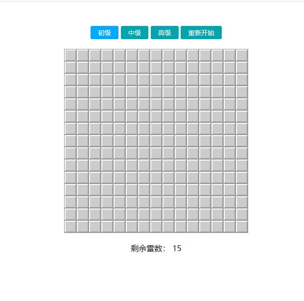

# ES6 面向对象之经典扫雷小游戏

### 闲话不多说，先上效果图

## 实现的功能

- ### 点击控制后按钮可以生成对应难度的雷盘

- ### 鼠标左右键点击每个格子可显示里面的数字或做标记

- ### 当点击出的数字为 0 时，通过扩散算法让这个格子周围为 0 的格子显示出来

- ### 随机雷的位置时不能将雷的信息保存在元素的类名上，防止用户通过检查元素类名来找到雷。

- ### 游戏结束时弹出当前游戏的时间。

## 主要思路：

- ### 由于有多个游戏难度供用户选择，所以采用面向对象的方式进行编程。

- ### 生成雷盘
  - #### 根据用户选择的难度通过循环雷盘行与列的方式来创建相应数量的表格，并以一个二维数组的格式好保存每个格子的 DOM 对象，然后将元素插入到页面中

- ### 生成随机数，并将每个方块的信息保存到二维数组中

  - #### 把雷盘每个格子的索引添加到一个数组中并截取出前 n 个数字进行乱序。

  - #### 以行与列的形式遍历，将雷的信息以对象的形式保存到一个二维数组中，类似于：

        [
          [
          {type: 'number', x: 1, y: 7, value: 0 }
          {type: 'number', x: 13, y: 4, value: 1 }
          {type: 'number', x: 3, y: 12, value: 4 }
          {type: 'number', x: 4, y: 14, value: 6 }
                ....
          ],
          [
          {type: 'number', x: 10, y: 4, value: 1 }
          {type: 'number', x: 2, y: 7, value: 2}
          {type: 'number', x: 11, y: 9, value: 6 }
          {type: 'number', x: 5, y: 2, value: 7 }
                ......
          ],
          [.......],
          ......
        ]
        里面一层的所有[]可以理解成一个列，[]里的每个对象可以理解为每列里有n个，展开后就是一个阵列。

- ### 找某个格子的四周格子的坐标
  - #### 首先必须要知道一个格子的坐标，然后通过以下的规律遍历九宫格，剔除周围非数字的格子、越界、传入的格子本身和雷的情况后，就可以将得到的坐标以数组的形式保存起来。

        找格子的规律
        x-1, y-1       x, y-1        x+1, y-1

        x-1, y         x, y          x+1, y

        x-1, y+1       x, y+1        x+1, y+1

  - #### 由于这种规律遍历是通过像素坐标的方式进行的，为了使保存的具有一致性，就得让得到的像素的 x,y 的顺序对调。

- ### 更新每个雷周围的数字
  - #### 通过遍历雷盘里所有的格子来找到是雷的格子的坐标，然后将雷的坐标依次调用找四周的方法来找到周围是数字的格子，并让里面的数字++。

- ### 扩散算法
  - #### 接收一个格子的坐标和保存有颜色类名的数组
  - #### 将接收到的坐标先调用找格子四周的方法，找到每个数字不为0的格子，让这个格子的数字和颜色显示在页面中。如果找到的是数字为0的格子，就要把找过的格子做个标记，将周围剩下的所有没有标记过的数字为格子的坐标，依次传入扩散算法中递归。

- ### 给雷盘绑定鼠标事件
  - #### 将事件源身上触发的事件冒泡到雷盘元素上执行。

  - #### 左键点击
    - 点击到数字
      - 非0数字：显示数字，并给一个class类名以展示字体颜色和背景色

      - 数字0：不显示数字值，给一个class类名以展示背景色，并去调用扩散算法，让当前被点击到的格子，显示周围数字为0的格子，实现那种一点一大片的操作。

    - 点击到雷
      - 调用游戏结束的方法。

  - #### 右键点击
    - 多次点击时小红旗的切换及其剩余雷数的变化
    - 将所有小红旗都标完后，只要有一个雷没有标中，就去调用游戏结束方法，否则就是游戏通过。

- ### 游戏结束
  - #### 如果点到雷就让点到的格子标个颜色。

  - #### 显示所有的雷。

  - #### 取消所有格子的点击事件，最后弹个文字。

- ### 获取游戏时长
  - #### 主要是将毫秒格式的时间转换为00:00:00格式的时间。

  - #### 时间超过3600秒时，最左边的两个0是十进制的数，其余的都是60进制的数，然后摩除于再拼接就得到了，最后记得更新上次保留的时间。

- ### 游戏难度按钮相关
  - #### 给按钮绑定事件，当按钮被点击就可以根据索引拿到相对应的雷盘的数据并生成，并做到按钮的切换。

  - #### 当点击的是重新开始可直接初始化一个新的同等难度等级的雷盘。
